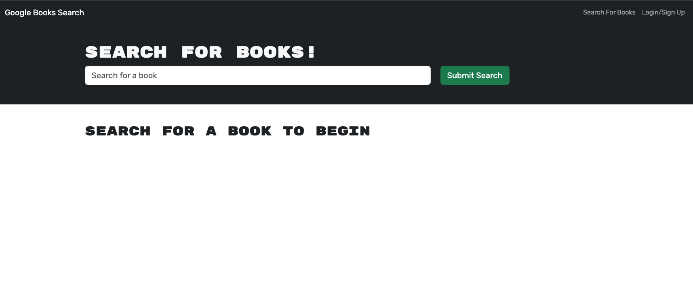
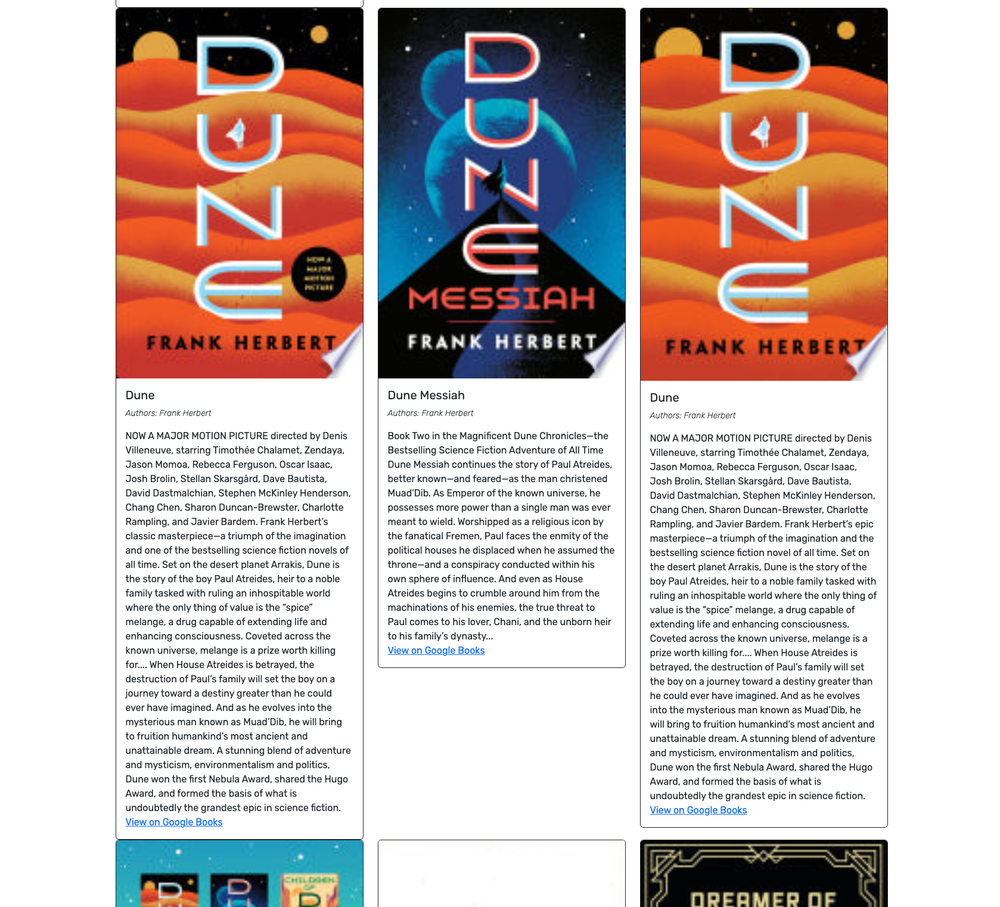
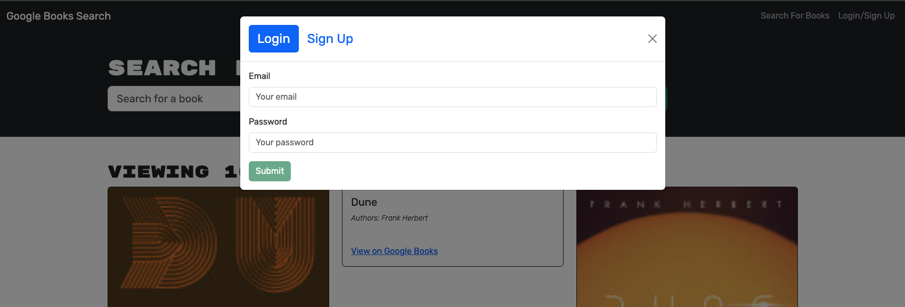
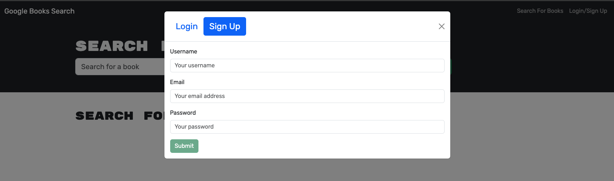
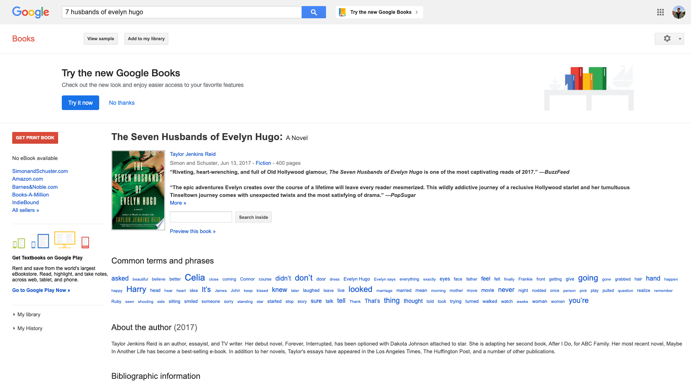

# MERN Book Search Engine

## Description 

Welcome to the book search engine! This web tool allow avid readers to search for and save books that they're interested in - whether they have already read the book or looking to pick it up on their next stop to the bookstore. 

When searching for a book, users will be presented with information for each book including the title, list of authors, description, image, and a link to view more details on the Google Books website. Please refer to the [usage](#usage) section of this README for more information regarding the features of the web tool.  

This webtool was built using Apollo Server and utilizes the Google Books API and GraphQL API. This app was also built using the MERN stack - with React front end, MongoDB database, and Node.js/ Express.js server and API. 

## Table of Contents 
- [Installation](#installation)
- [Dependencies](#dependencies)
- [Usage](#usage)
- [Contributing](#contributing)
- [License](#license)
- [Questions](#questions)
  
## Installation 
There is no installation necessary for this application as it is deployed using [Render](https://docs.render.com/). You can access and use the application [here](https://mern-book-search-engine-lkfi.onrender.com/) or at the following link: https://mern-book-search-engine-lkfi.onrender.com/

If you are interested in running the application locally, please use the following steps:
1. Clone this repository to your local machine. (For reference, visit the [Cloning a Repository](https://docs.github.com/en/repositories/creating-and-managing-repositories/cloning-a-repository) GitHub Docs article.)
2. Run `npm install && npm run build` in your CLI to download the npm package dependencies and build the app using vite.
3. Run `npm run develop` to start up the backend and serve the client.
4. Navigate to `http://localhost:3000` on your local web browser to use the application. 
  
## Dependencies
This project requires the following npm package dependencies for the back-end server, which are included in the `server/package.json` file.
1. @apollo/server
2. apollo-server-express
3. bcrypt
4. express
5. graphql
6. jsonwebtoken
7. mongoose

Thie project requires the following npm package dependencies for the front-end client, which are included in the `client/package.json` file.

1. @apollo/client
2. bootstrap
3. graphql
4. graphql-tag
5. jwt-decode
6. react
7. react-bootstrap
8. react-dom
9. react-router-dom

## Usage 
When launching the application, users will be presented with a navigation bar to search for books, as well as the option to login/ signup. 
  

While not logged in, users can still search for books to see information about them. This includes an image, title, list of authors, description, as well as a link to view more information on the Google Books website. Notice that while not logged in, the user will not have the option to "save" the book. 
  

If the user is interested in signing up or logging in to their account, they may press the "Login/Sign up" option in the navigation bar to open a modal to do so. To login, the user will need to enter the email and password they used to register. To signup for an account, the user will need to enter a unique username, valid email, and password.

  

After successfully logging in, the user will be presented the option to "See Your Books" in the navigation bar. Now, when returning to the "Search For Books" page, the user will see the option to save the corresponding book. 
  

When navigating to the "See Your Books" page, the user will see all the books that they have saved to their account. From here, the user will also have the option to delete the book from their saved books list. 
  

After clicking the button to "View on Google Books" for the respective book, a new browser tab will open to the corresponding book on the Google Books website for more details. 

## Contributing
To make contributions to this project:  
1. Fork the repository  
2. Make some commits to improve the application
3. Open a Pull Request on GitHub
4. From there, we can discuss your changes and merge the pull request once your contributions have been approved!

## License 
This GitHub repository is licensed under the MIT license. Please refer to the license documentation [here](https://opensource.org/licenses/MIT).
  
## Questions
This project was developed by [dymoy](https://github.com/dymoy).  
For any related questions, please contact me via email at <derekymoy@gmail.com>.
